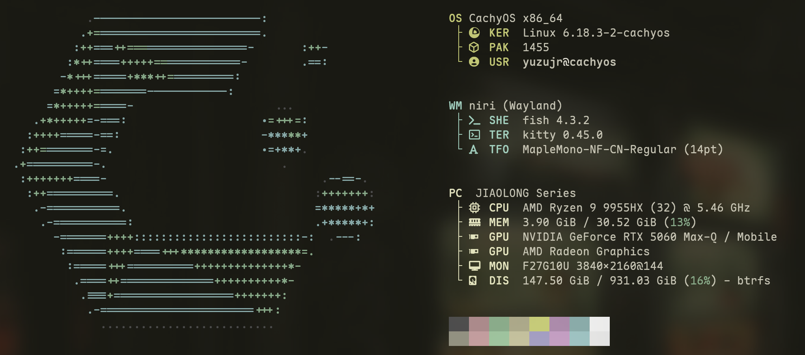

# Linux 生存手册




## 🌐 吉林大学校园网认证（Drcom）

```shell
git clone https://github.com/AndrewLawrence80/jlu-drcom-client
cd jlu-drcom-client
# 修改 config.h 中的账号密码等参数
make
./drclient_jlu
```

或者可以用我的c++跨平台版本，地址：[github](https://github.com/yuzujr/drcom-client-cpp)

**有线连接**

需要使用`nmcli`或者桌面环境自带的图形化配置界面，配置`有线连接`：

- `克隆 MAC 地址`：校园网账号的物理地址
- `IPv4`：方式改为`手动`，配置`DNS服务器`、`IP地址`、`子网掩码`、`网关`。

重启有线连接后，重新运行`drclient_jlu`。

## 🇨🇳 科学上网

只需要下载[clash verge rev](https://github.com/clash-verge-rev/clash-verge-rev)，

然后通过url导入配置文件即可。

进阶用户可选择直接运行mihomo内核，自行控制proxy providers和rule providers。

ui可使用**[metacubexd](https://github.com/MetaCubeX/metacubexd)**。

## 🪛 n卡驱动

提前安装`nvidia`(如果使用50系显卡，此处应为`nvidia-open`)、`nvidia-settings`、`nvidia-utils`。

### 步骤 1：启用 nvidia_drm

修改`/etc/default/grub`:

```
GRUB_CMDLINE_LINUX_DEFAULT="nvidia_drm.modeset=1"
```

在原有的参数中加入`nvidia_drm.modeset=1`即可。

### 步骤2：桌面环境设置n卡优先

**确认独显位置**：

1. `lspci | grep -E "VGA"` 得到独显的pci名，例如`01:00.0`。
2. `ll /dev/dri/by-path/`得到pci名对应的`cardx`和`renderDxxx`

在下面的设置中，将独显放在前面

- KDE：创建`~/.config/plasma-workspace/env/kwin-drm.sh`

  ```bash
  #!/bin/bash
  export KWIN_DRM_DEVICES="/dev/dri/card0:/dev/dri/card1"
  ```

- Hyprland：在hyprland或者uwsm配置文件中加入：

  ```bash
  export AQ_DRM_DEVICES="/dev/dri/card0:/dev/dri/card1"
  ```

- Niri：在任意niri配置文件（例如`~/.config/niri/config.kdl`）中加入

  ```
  debug {
      render-drm-device "/dev/dri/renderD128" // 独显
      ignore-drm-device "/dev/dri/renderD129" // （可选）此选项会禁用对应的显卡，将导致笔记本屏幕或外接屏幕无法亮起
  }
  ```

### 步骤3：验证

```shell
lsmod | grep nvidia # 应输出nvidia_drm等
```

### 步骤4: 功率控制

查看`nvidia-smi`的输出，如果显卡的最大功率不是预期值，则需要
```shell
sudo systemctl enable --now nvidia-powerd.service
```
再次查看`nvidia-smi`，问题解决，并且笔记本的切换功率功能可以使用了

### （可选）安装CachyOS

使用CachyOS会自动配置显卡驱动，但是安装过程可能会因网络原因失败。

## 🖕 关于Nvidia的BUG

### QQ wayland原生启动画面撕裂

尽管已经设置了n卡优先（见[桌面环境设置n卡优先](#步骤2桌面环境设置n卡优先)），QQ仍然会使用核显，由于桌面环境本身使用独显渲染，所以会产生大量数据拷贝，并且核显性能低下，如果占满会导致QQ出现马赛克画面撕裂

问题根源：`libglvnd`在选择`EGL`提供者时，选择了`mesa`，导致使用核显渲染，对于n卡用户来说，应该使用`nvidia`。

解决方法：手动指定QQ启动时的`EGL`提供者

```shell
env __EGL_VENDOR_LIBRARY_FILENAMES=/usr/share/glvnd/egl_vendor.d/10_nvidia.json linuxqq
```

## 🔐 登录界面：移除多余桌面环境

删除或重命名以下目录下不需要的 `.desktop` 文件：

- `/usr/share/xsessions/`
- `/usr/share/wayland-sessions/`

## 🧩 KDE 设置 Windows 风格 Alt+Tab

### 步骤一：移除延迟

```bash
kwriteconfig5 --file ~/.config/kwinrc --group TabBox --key DelayTime 0
qdbus org.kde.KWin /KWin reconfigure
```

### 步骤二：设置任务切换器样式

- 打开「设置」 → 「窗口管理」 → 「任务切换器」
- 取消勾选「显示选中窗口」
- 获取新样式：下载 "Aqua Medium Icons"

## 🎯 更改鼠标指针样式与大小

### 更换鼠标主题（适用于 X11）

修改 `/usr/share/icons/default/index.theme`

### 修改 `.Xresources`

```bash
Xcursor.theme: default
Xcursor.size: 24
```

### 修改 GNOME 鼠标大小

```bash
gsettings set org.gnome.desktop.interface cursor-size 24
```

## 🖕 windows作为ssh服务器如何配置免密登录

前期所有工作都和Linux配置一样

然而会发现这样仍然无法免密登录

**解决方法**：

打开`C\ProgramData\ssh\sshd_config`

注释下面两行

```
Match Group administrators
       AuthorizedKeysFile __PROGRAMDATA__/ssh/administrators_authorized_keys
```

然后在`服务`里面重启`OpenSSH SSH Server`服务就完成了。
