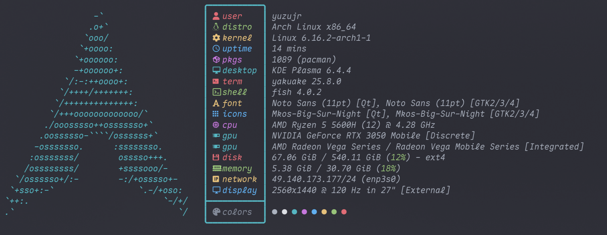
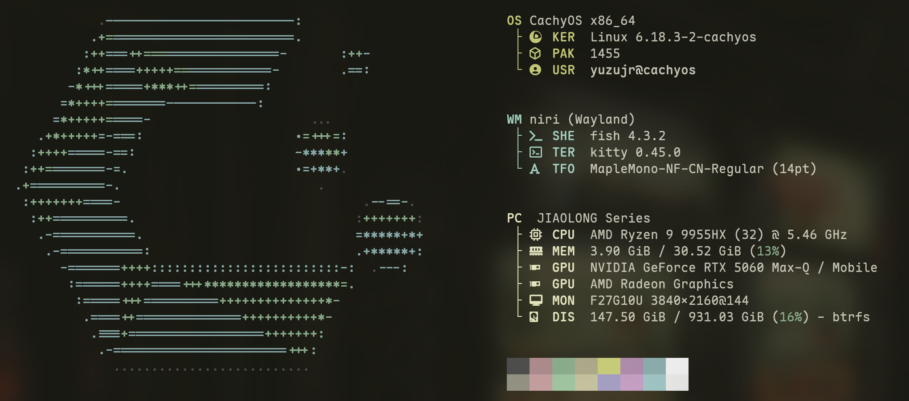
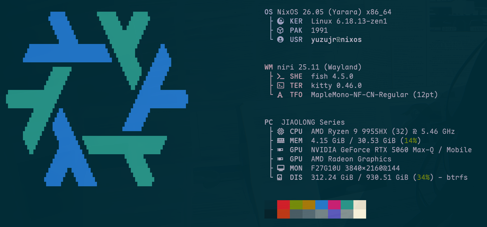

# 前言

系统路线：

- Arch Linux
- CachyOS
- 回到 Arch Linux
- 现在是 NixOS

  <figure class="shot-card">
    
    <figcaption>Arch</figcaption>
  </figure>
  <figure class="shot-card">
    
    <figcaption>CachyOS</figcaption>
  </figure>
  <figure class="shot-card">
    
    <figcaption>NixOS</figcaption>
  </figure>

## 站点结构

- 每个问题单独成文
- 目录按类别组织
- 长文只保留为总览或归档

## 当前重点

- NixOS / Nix
- 驱动与引导
- 桌面与图形问题

## 使用方式

1. 先看 [目录](/notes/)
2. 按分类进入具体问题
3. 最近内容优先看 [Nix / NixOS 常用命令整理](/notes/nix-cli-guide.md)
